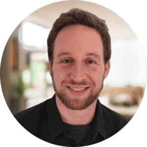

## Who I am

I'm Marco, a backend engineer living in Mallorca. Originally from northern Germany, I moved to Spain a few years ago and haven't looked back. I like building things that work reliably at scale, and I care a lot about clean architecture and thoughtful system design.

## What I do

I'm currently a Software Engineer at Shinefour, where I design and build an event-driven integration platform that unifies REST, webhook, gRPC, and WebSocket-based third-party integrations behind a NATS messaging layer. Day to day, that means working with Java and Spring Boot, message-driven services, microservices, and figuring out how to make complex systems play nicely together.

My sweet spot is backend and distributed systems: Event-driven architectures, CDC pipelines, API design, and infrastructure with tools like AWS, Kubernetes, Terraform, and Docker.

## Languages I work in

I've moved around a fair bit. I spent several years mostly in Go, and it shaped how I think about software more than any other language: Explicit over clever, few dependencies, and a strong bias towards simplicity. I still reach for it when I get to choose.

Right now most of my work happens in the Java and Spring Boot world, with a growing amount of Node.js and TypeScript alongside it. Switching between them is more interesting than it sounds. The same problems keep showing up in all three, and each ecosystem has strong opinions about how to solve them. Comparing those opinions is where a lot of my writing comes from.

## Background

I've been writing software professionally since 2014. Over the years I've worked across different domains: From maritime logistics (building berth planning systems for container ports) to healthcare tech, and more recently AI-powered backend platforms and integration systems.

I studied Business Informatics (BS) and E-Health (MA) at Flensburg University of Applied Sciences in Germany.

## This site

I write about things I run into while building software: Distributed systems, event-driven patterns, the trade-offs between languages and ecosystems, and whatever else I find worth sharing. No schedule, no pressure, just notes from the trenches.

## Contact

The best way to reach me is via [LinkedIn](https://www.linkedin.com/in/marcogerstmann) or [GitHub](https://github.com/marcogerstmann).
